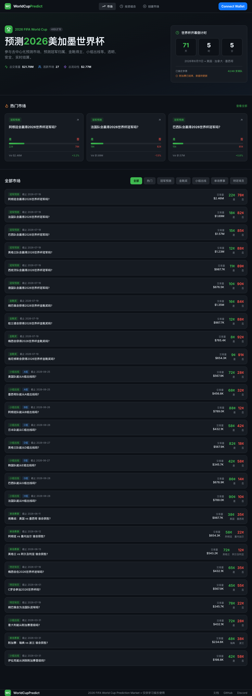

# 🏆 WorldCupPrediction 2026

[](https://soliditylang.org/)
[](https://reactjs.org/)
[](https://www.typescriptlang.org/)
[](https://hardhat.org/)
[](LICENSE)

> 🌟 基于区块链的2026美加墨世界杯预测市场 | A decentralized prediction market for the 2026 FIFA World Cup



## ✨ 功能特性

### 核心功能
- **🔮 预测市场创建** - 支持二元预测（是/否）和多结果预测
- **💱 自动做市商(AMM)** - 基于恒定乘积公式(CPMM)的价格发现机制
- **📈 限价单交易** - 支持限价买单、限价卖单、止损单、止盈单
- **💰 流动性挖矿** - 提供流动性赚取交易手续费和代币奖励
- **🔒 去中心化结算** - 通过预言机自动结算市场结果
- **⚡ 实时价格图表** - 30天价格走势可视化

### 预测类型
- 🏆 **冠军预测** - 哪支球队将赢得世界杯
- ⚽ **金靴奖** - 最佳射手预测
- ✅ **小组出线** - 球队能否从小组晋级
- 🆚 **单场赛事** - 具体比赛结果预测
- 👤 **特定球员** - 球员表现预测

### 技术亮点
- 智能合约使用 Solidity 0.8.26 + Cancun EVM
- 支持 ERC1155 条件代币（Conditional Tokens）
- TheGraph 子图索引链上数据
- 完全去中心化前端（IPFS部署就绪）
- 实时数据预言机更新球队晋级状态

## 🏗️ 技术栈

### 智能合约
| 技术 | 版本 | 用途 |
|------|------|------|
| Solidity | 0.8.26 | 智能合约语言 |
| Hardhat | 2.x | 开发框架 |
| OpenZeppelin | 5.x | 安全合约库 |
| Ethers.js | 6.x | 区块链交互 |

### 前端
| 技术 | 版本 | 用途 |
|------|------|------|
| React | 18.x | UI框架 |
| TypeScript | 5.x | 类型安全 |
| Vite | 5.x | 构建工具 |
| TailwindCSS | 3.x | 样式框架 |
| Wagmi | 1.x | Web3 React Hooks |
| RainbowKit | 1.x | 钱包连接 |
| Recharts | 2.x | 数据可视化 |

### 数据索引
| 技术 | 用途 |
|------|------|
| TheGraph | 链上事件索引 |
| GraphQL | 数据查询 |
| Apollo Client | 前端数据获取 |

## 📁 项目结构

```
├── contracts/                 # 智能合约
│   ├── contracts/
│   │   ├── EnhancedPredictionMarket.sol      # 增强版预测市场合约
│   │   ├── EnhancedPredictionMarketFactory.sol # 市场工厂合约
│   │   ├── ConditionalTokens.sol              # 条件代币合约
│   │   ├── WorldCupDataOracle.sol             # 世界杯数据预言机
│   │   └── MockUSDC.sol                       # 测试代币
│   ├── deploy/                # 部署脚本
│   ├── subgraph/              # TheGraph子图
│   │   ├── schema.graphql
│   │   ├── subgraph.yaml
│   │   └── src/
│   └── test/                  # 合约测试
├── frontend/                  # 前端应用
│   ├── src/
│   │   ├── pages/             # 页面组件
│   │   │   ├── Home.tsx       # 首页
│   │   │   ├── MarketDetail.tsx # 市场详情
│   │   │   ├── Portfolio.tsx  # 投资组合
│   │   │   └── CreateMarket.tsx # 创建市场
│   │   ├── data/
│   │   │   └── markets.ts     # 市场数据
│   │   ├── config/
│   │   │   ├── wagmi.ts       # Web3配置
│   │   │   └── oracle.ts      # 预言机配置
│   │   └── abis/              # 合约ABI
│   └── public/
└── README.md
```

## 🚀 快速开始

### 前置要求
- Node.js >= 18
- npm >= 9
- Git

### 1. 克隆项目

```bash
git clone https://github.com/yourusername/worldcup-prediction-2026.git
cd worldcup-prediction-2026
```

### 2. 安装依赖

```bash
# 安装合约依赖
cd contracts
npm install

# 安装前端依赖
cd ../frontend
npm install
```

### 3. 启动本地网络

```bash
cd contracts
npx hardhat node
```

### 4. 部署合约

```bash
# 在另一个终端窗口
cd contracts
npm run deploy:local
```

### 5. 启动前端

```bash
cd frontend
npm run dev
```

访问 http://localhost:5173 查看应用

## 📝 使用指南

### 创建预测市场

1. 点击"创建市场"
2. 选择模板（冠军预测/晋级预测/金靴奖）或自定义
3. 输入预测问题和描述
4. 设置结算时间（必须晚于实际比赛结束）
5. 确认创建并支付创建费用

### 交易份额

1. 浏览市场列表，选择感兴趣的市场
2. 查看当前价格和赔率
3. 选择买入 Yes 或 No 份额
4. 输入金额，查看潜在收益
5. 确认交易

### 提供流动性

1. 在市场详情页点击"提供流动性"
2. 输入 USDC 数量
3. 获得 LP 代币，开始赚取交易手续费

### 结算市场

1. 比赛结果确认后，预言机调用结算函数
2. 持有获胜方向份额的用户可领取奖励
3. 每份获胜份额可兑换 1 USDC

## 🏆 2026世界杯数据

本项目使用链上预言机管理世界杯数据：

- **已确定参赛**: 42/48 支球队（截至 2026年3月）
- **附加赛待定**: 6 支球队（3月31日决出）
- **主办国**: 美国、加拿大、墨西哥

数据自动更新，无需重新部署前端。

## 🧪 测试

### 合约测试

```bash
cd contracts
npx hardhat test
```

### 前端测试

```bash
cd frontend
npm run test
```

## 🌐 部署到生产环境

### 部署到测试网

```bash
cd contracts
npx hardhat run deploy/01_deploy_contracts.js --network goerli
```

### 部署TheGraph子图

```bash
cd contracts/subgraph
npm run codegen
npm run build
npm run deploy
```

### 构建前端

```bash
cd frontend
npm run build
```

构建后的文件在 `dist/` 目录，可部署到 IPFS/Arweave 或传统服务器。

## 🔐 安全

- 合约使用 OpenZeppelin 标准库
- 实现重入保护（ReentrancyGuard）
- 紧急暂停功能
- 权限控制（Ownable）

**⚠️ 免责声明**: 本项目仅供学习和娱乐使用，不构成投资建议。

## 🤝 贡献

欢迎提交 Issue 和 Pull Request！

1. Fork 本项目
2. 创建特性分支 (`git checkout -b feature/AmazingFeature`)
3. 提交更改 (`git commit -m 'Add some AmazingFeature'`)
4. 推送到分支 (`git push origin feature/AmazingFeature`)
5. 创建 Pull Request

请阅读 [CONTRIBUTING.md](CONTRIBUTING.md) 了解详细规范。

## 📄 许可证

本项目基于 [MIT](LICENSE) 许可证开源。

## 🙏 致谢

- [Polymarket](https://polymarket.com/) - 预测市场设计灵感
- [Gnosis Conditional Tokens](https://github.com/gnosis/conditional-tokens-contracts) - 条件代币实现
- [OpenZeppelin](https://openzeppelin.com/) - 安全合约库

## 📞 联系方式

- Twitter: [@yourhandle](https://twitter.com/yourhandle)
- Discord: [邀请链接]
- Email: your.email@example.com

---

⭐ 如果这个项目对你有帮助，请给它一个 Star！
